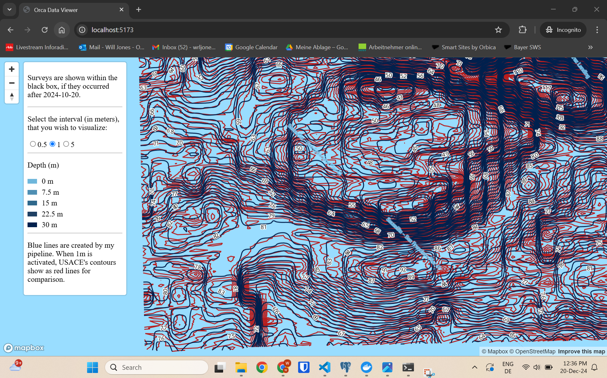

# Orca Bathymetry Coding Challenge
#### Completed 20.12.2024, by William Jones. https://www.linkedin.com/in/william-jones-spatial/

The challenge is documented in Instructions.md. Here is my implementation. This architecture runs locally, and without any consideration for security. Once deployed, security would be of upmost importance.

#### Data formats:
- USACE provide many data formats. Therefore there are many ways to complete this task.
- Esri TIN cannot be easily converted to raster without ArcGIS Pro. Mdal has a driver, but can't transform it to raster.
- Therefore I will make the raster myself from the survey points.
  

## Performance
- It takes about 5 minutes to process each survey, depending on the survey area. This is fine for this proof of concept.
- The tiles are dynamically generated very performantly, and the map application shows this.

## Tool choices and rationale:

- GDAL is simple to install, use, and is extremely powerful so it does the main processing.
- PostGIS is used where possible.
- Geoparquet is used as a temporary file storage because it is very small and performant.
- I smooth the raster before creating contour lines so that they are made less jagged.
- I simplify and then smooth the vector contour lines to again make them much nicer looking (while preserving their shape and location).
- I have output depth isoline polylines. These could simply be converted to polygons if needed (we would need to account for the edges of the AOI because these will cut polygons).
- tipg is used to serve tiles from postgis because it is simple to run with Docker, and serves tiles which are performant and queryable.
- The frontend uses modern, best practice architecture for a simple web mapping app like this.
- I interpreted "reasonable depth intervals (e.g., 0m, 0.5m, 1m, 2m, 5m, 10m)" to mean that I should make different iterations of contours with 0.5, 1, and 5m intervals. These could be combined if desired.
  

## Strategies for optimizing processing workflows:

- Investigate using these tools: https://github.com/MathiasGroebe/Smooth-Contours, or https://hkartor.se/anteckningar/contour_lines_script.html. They may have made part of this process faster/better.
- Apache Airflow is ideal for automating data processing pipelines. It can manage complex data workflows. It allows for the orchestration of tasks.
- Containerise \data_processing\main.py for dependency management.
- If pipeline needs to support more processes, move away from GDAL shell commands and use Python packages.
- Run PostgreSQL in another Docker Container. This provides the flexibility to deploy, scale and configure the database independently. Resource allocation, and backup/recover are made simpler.
- Leverage PostGIS Functions for Geospatial Processing: I am already simplifying, and smoothing using PostGIS. If we had to do queries or joins then we should definitely use PostGIS.
- Batch processing with Airflow: subsets of surveys could be processed together (e.g. by geographical regions).
- Parallel Execution: whether using Airflow or not, executing multiple tasks in parallel, should significantly speed up processing when dealing with large datasets.
- Batch processing with PostgreSQL: Use SQL to handle large data volumes in batches. This can be done by processing data in chunks, running batch jobs that process records in smaller pieces, and updating the status of each batch. This prevents the processing pipeline from overloading the system when working with large datasets.
- Add automated testing. Unit and integration tests.
- When processing, check if a survey has already been processed, so that time is not wasted reprocessing.
  
  

# Setup:

Follow these steps in order:

## 1. PostgreSQL

1. Install locally, use very basic credentials and schema.
2. Add PostGIS extension. 
> CREATE EXTENSION postgis;

## 2. Pipeline
  
1. Install git, Python, and OSGEO4W.
2. Run:
> git clone https://github.com/willjnz/orca-coding-challenge.git
> cd orca/coding-challenge
3. Add "C:\OSGeo4W64\bin" to PATH so gdal is callable as a command
4. Run:
> cd data_processing
> pip install -r requirements.txt
5. Run main.py 

## 3. Tile Server

1. Update pg_hba.conf to allow the Docker network's IP range
2. Install Docker Desktop
3. Pull the Docker image:
> docker pull ghcr.io/developmentseed/tipg:uvicorn-latest
4. Run the Docker container:
> docker run -d -p 8081:80 --env POSTGRES_HOST=host.docker.internal --env POSTGRES_PORT=5432 --env POSTGRES_USER=postgres --env POSTGRES_PASS=postgres --env POSTGRES_DB=postgres ghcr.io/developmentseed/tipg:uvicorn-latest  

## 4. Frontend Map Application

**Technologies:** Vite.js, React, Typescript, Mapbox GL JS application. Displays vector tiles from tipg.

1. Run:
> cd application
> npm install
> yarn run dev

Here is an image showing my smooth 1m contours vs. USACE's jagged contours:
